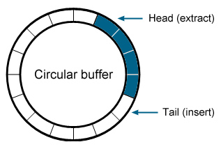
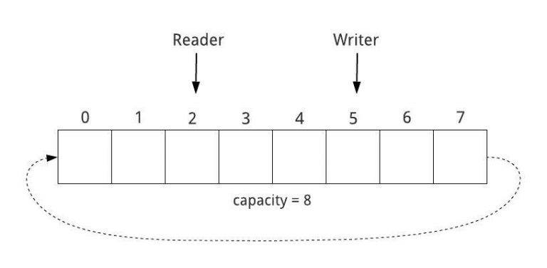
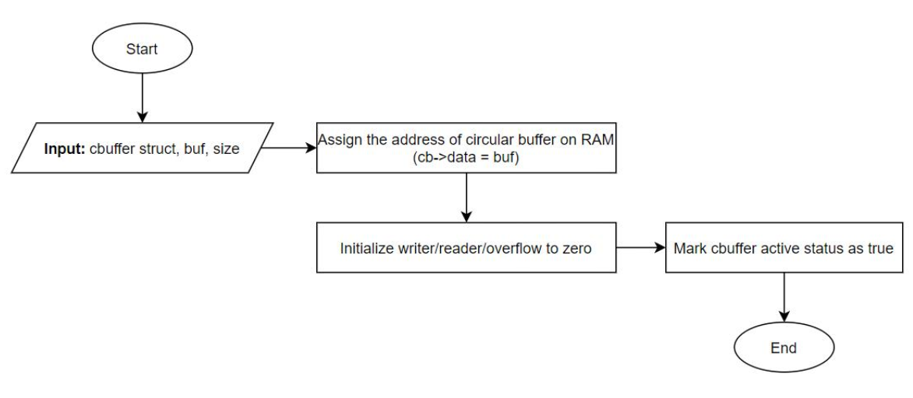
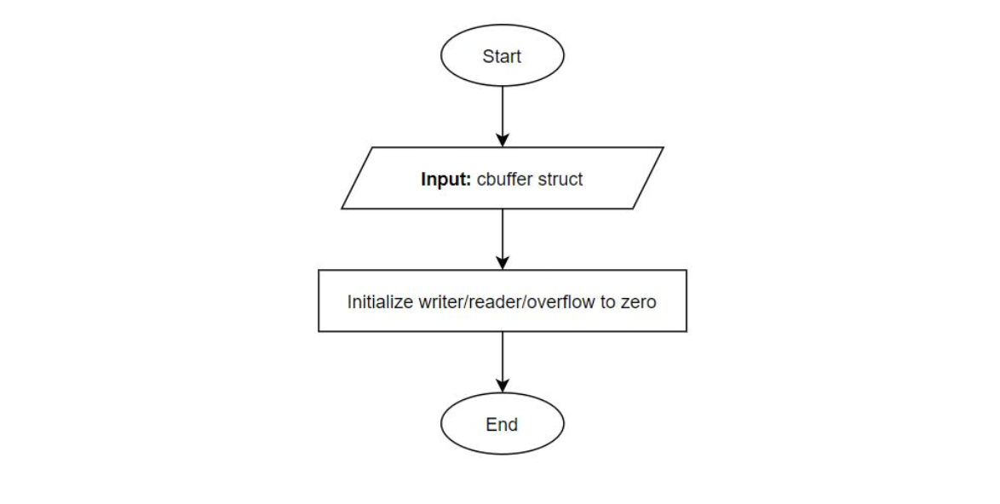
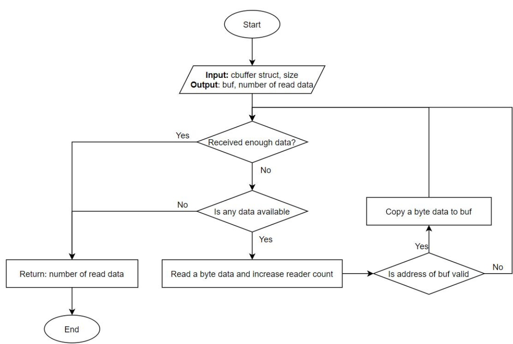
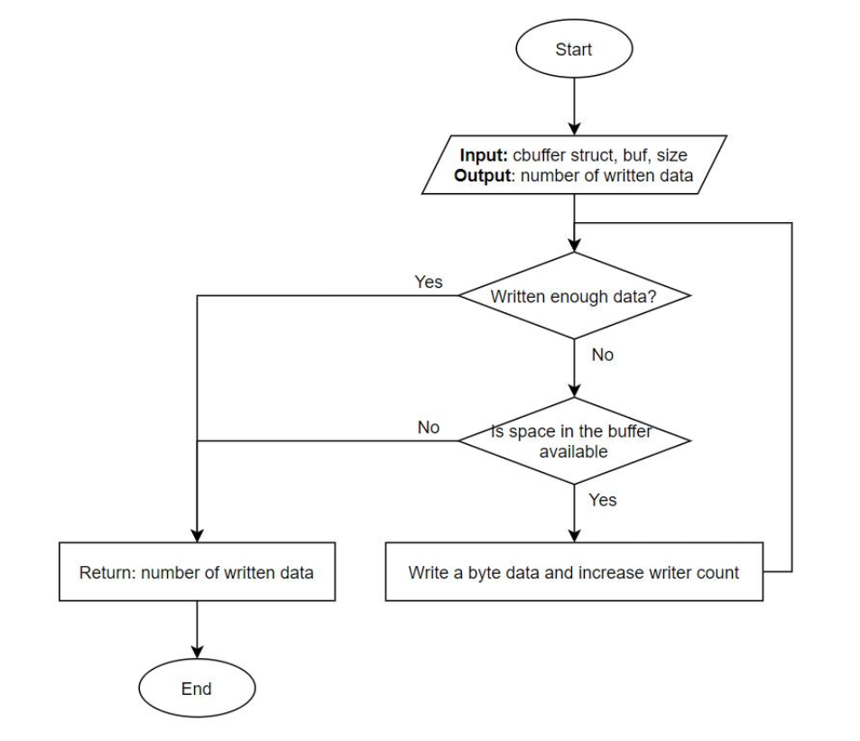
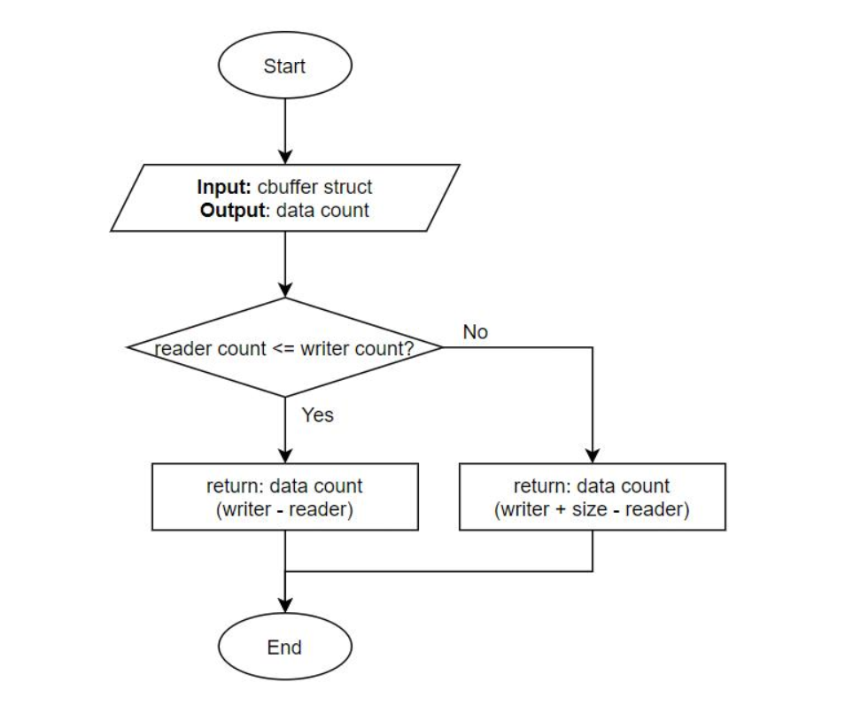
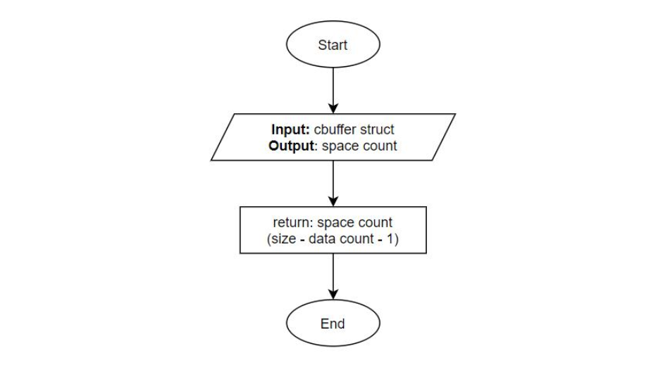

**Version**: 1.0.0
**Author**: Group 5
**Update**: 2025-08-14

# CIRCULAR BUFFER
## Overview
#### A. Definition
A **Circular Buffer** is a single string of data buffers where **the head** (first position) and **tail**(last position) **are connected**, allowing overwrite operation to carry on from the head when the buffer is full.
The Circular Buffer uses **FIFO logic**, when removing some values, the oldest available will be the first to be removed.



Figure 1. Circular Buffer

#### B. Reader and Writer
To control the flow of the read/write operation, Circular Buffer requires 2 pointers (or counter) known as **Reader** and **Writer**. Both will start at the head of the Circular Buffer, **Writer** move when the write operation occurs, and the **Reader** will advance when the read operation occurs.



Figure 2. Reader and Writer

## API References
#### A. cb_init
- **API**: void **cb_init**(cbuffer_t *cb, void *buf, uint32_t size)
- **Flowchart**:

Figure 3. Flowchart of cb_init API
- **Implementation**:
```C
void cb_init(cbuffer_t *cb, void *buf, uint32_t size)
{
    if (cb == NULL || buf == NULL)
        return;
    cb->data = (uint8_t*)buf;
    cb->size = size;
    cb->writer = 0;
    cb->reader = 0;
    cb->overflow = 0;
    cb->active = true;
    return;
}
```
- **Purpose**: Initialize a new Circular Buffer
- **Description**: **cb_init** requires input consisting of a **circular buffer structure** (cbuffer_t), **pointer to a memory-allocated buffer** (buf), and **the size of the circular buffer** (size). In the initialization process, the circular buffer will be marked as **“active”**, allowing the write operation to start at the first position of the buffer (head).

#### B. cb_clear
- **API**: void **cb_clear**(cbuffer_t *cb)
- **Flowchart**:

Figure 4. Flowchart of cb_clear API
- **Implementation**:
```C
void cb_clear(cbuffer_t *cb)
{
    if (cb == NULL)
        return;
    cb->writer = 0;
    cb->reader = 0;
    cb->overflow = 0;
    return;
}
```
- **Purpose**: Clear counter and data of assigned Cbuffer.
- **Description**: Reset Cbuffer’s **reader**, **writer**, and **overflow counter**, technically, ignore and allow
overwrite of all currently valid data in Cbuffer.

#### C. cb_read
- **API**: uint32_t **cb_read**(cbuffer_t *cb, void *buf, uint32_t nbytes)
- **Flowchart**:

Figure 5. Flowchart of cb_read API
- **Implementation**:
```C
uint32_t cb_read(cbuffer_t *cb, void *buf, uint32_t nbytes)
{
    if (cb == NULL || buf != NULL || !cb->active)
        return NOT_VALID;
    uint32_t count = 0;
    while (count < nbytes)
    {
        if (cb_data_count(cb) == NOT_VALID)
            break;
        else
        {
            ((uint8_t*)buf)[count] = cb->data[cb->reader];
            cb->reader = (cb->reader + 1) % cb->size;
        }    
        count++;
    }
    return count;
}
```
- **Purpose**: Read a number of byte from Cbuffer and raise the reader count.
- **Description**: **Read** **“n_byte”** number of data from Cbuffer and **store** it in “buf” (an external buffer ). The actual read bytes will be returned.

#### D. cb_write
- **API**: uint32_t **cb_write**(cbuffer_t *cb, void *buf, uint32_t nbytes)
- **Flowchart**:

Figure 6. Flowchart of cb_write API
- **Implementation**:
```C
uint32_t cb_write(cbuffer_t *cb, void *buf, uint32_t nbytes)
{
    if (cb == NULL || buf != NULL || !cb->active)
        return NOT_VALID;
    uint32_t count = 0;
    while (count < nbytes)
    {
        if (cb_space_count(cb) == NOT_VALID)
        {
            cb->overflow = nbytes - count;
            break;
        }
        else
        {
            cb->data[cb->writer] = ((uint8_t*)buf)[count];
            cb->writer = (cb->writer + 1) % cb->size;
        }    
        count++;
    }
    return count;
}
```
- **Purpose**: Read a number of byte from Cbuffer and raise the reader count.
- **Description**: **Read** “n_byte” number of data from Cbuffer and **store** it in “buf” (an external buffer ). The actual read bytes will be returned.

#### E. cb_data_count
- **API**: uint32_t **cb_data_count**(cbuffer_t *cb) 
- **Flowchart**:

Figure 7. Flowchart of cb_data_count API
- **Implementation**:
```C
uint32_t cb_data_count(cbuffer_t *cb) 
{
    if (cb == NULL) 
        return NOT_VALID;
    if (cb->reader <= cb->writer)
        return cb->writer - cb->reader;
    else
        return cb->writer + cb->size - cb->reader;
}
```
- **Purpose**: Calculate readable bytes from cbuffer.
- **Description**: cb_data_count calculate **the number of readable bytes** base on reader and writer count.

#### F. cb_space_count
- **API**: uint32_t **cb_space_count**(cbuffer_t *cb) 
- **Flowchart**:

Figure 8. Flowchart of cb_space_count API
- **Implementation**:
```C
uint32_t cb_space_count(cbuffer_t *cb) 
{
    if (cb == NULL)
        return NOT_VALID;
    return cb->size - cb_data_count(cb) - 1;
}
```
- **Purpose**: Calculate readable bytes from cbuffer.
- **Description**: cb_data_count calculate the number of readable bytes base on reader and writer count.